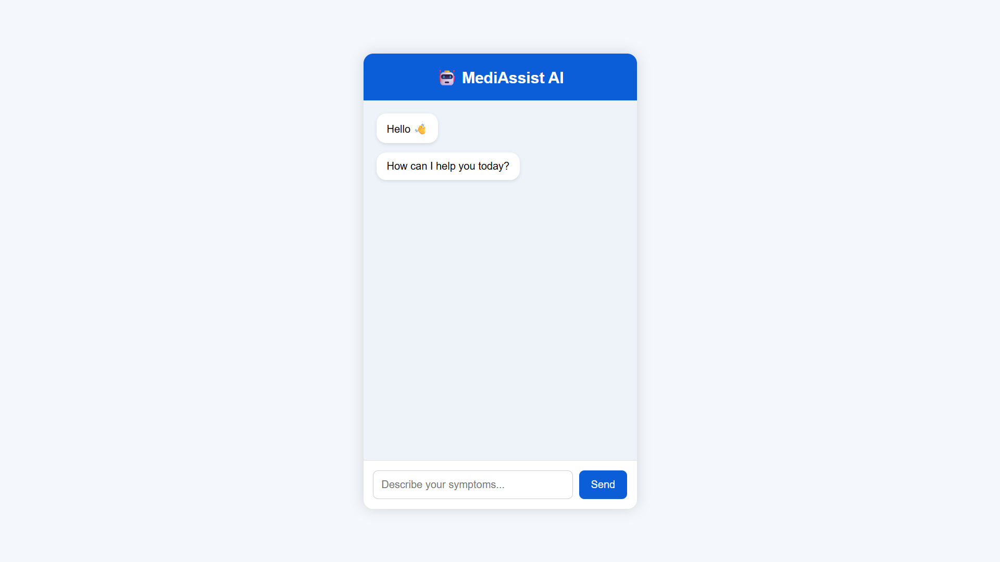
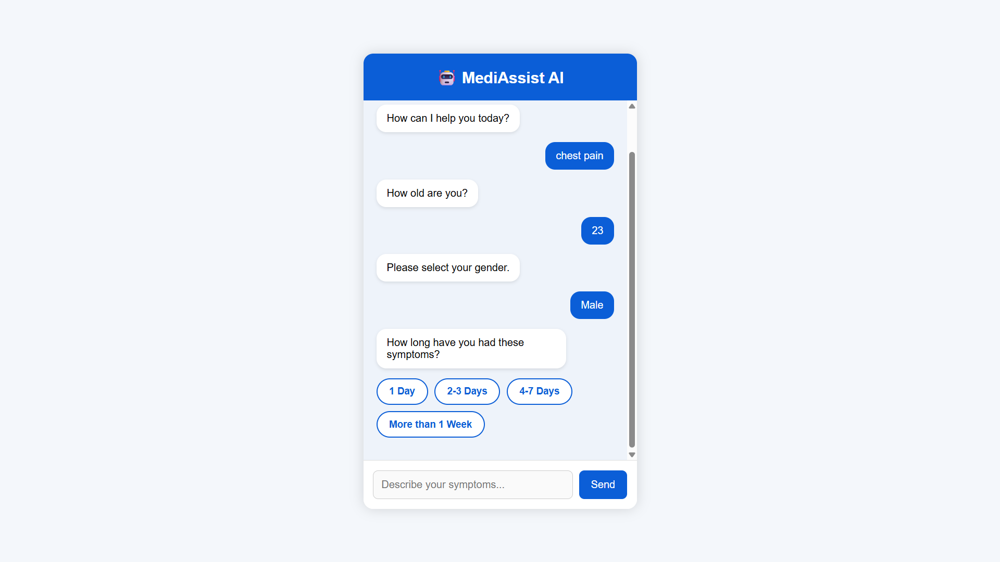
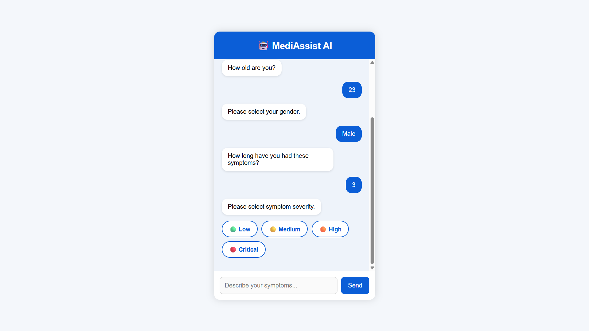
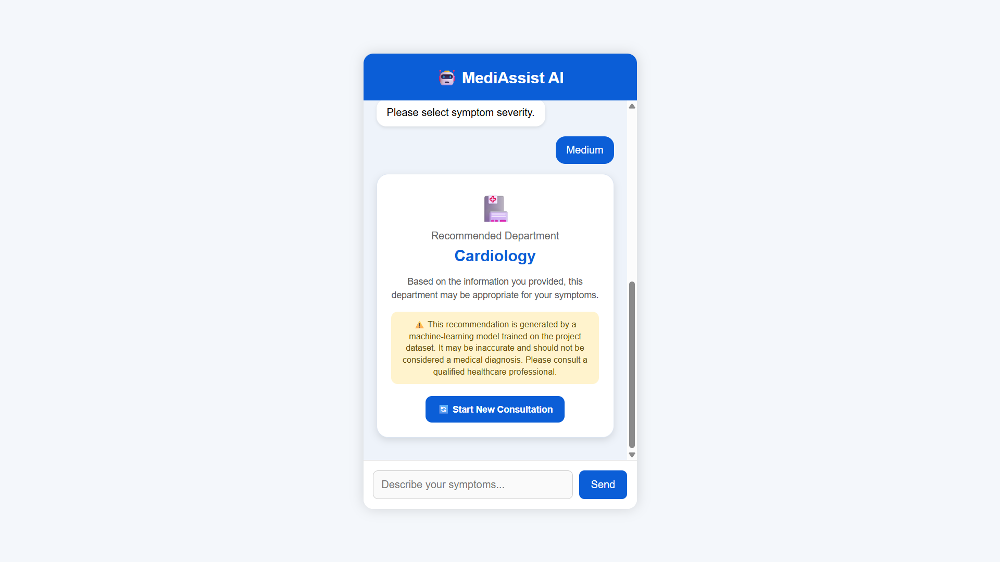

# MediAssist AI – Hospital Support Chatbot

MediAssist AI is a machine learning project that provides a simple chatbot interface for collecting basic symptom-related information and recommending a suitable hospital department.

The project combines a trained machine learning model with a Flask web application to make the prediction accessible through a simple chatbot interface.

> ⚠️ **Disclaimer:** This project is for educational purposes only. The recommended department is generated by a machine learning model trained on the project dataset and may be inaccurate. It should not be considered a medical diagnosis or a replacement for professional medical advice.

---

## 🎥 Project Demo

[▶️ Watch the MediAssist AI Demo](https://github.com/user-attachments/assets/1c3f2622-9a5d-441c-8163-fd9d50307ce3).

---

## 📸 Screenshots

### Home Screen



### Chatbot Conversation





### Department Recommendation



---

## 📌 Project Overview

The main idea of this project is to create a simple hospital support chatbot that takes information from the user and uses a trained machine learning model to recommend a hospital department.

The chatbot collects:

- Symptoms / complaint
- Age
- Gender
- Duration of symptoms
- Severity

This information is processed and provided to the trained machine learning model for prediction.

The predicted department is then displayed to the user through the chatbot interface.

---

## ✨ Features

- Simple chatbot-based interface
- Collects symptom-related information step by step
- Provides button-based options for gender, duration and severity
- Uses TF-IDF for text feature extraction
- Uses structured features such as age, gender, duration and severity
- Combines text and structured features for prediction
- Uses a trained machine learning model for department prediction
- Displays the recommended department in a result card
- Includes a medical disclaimer
- Option to start a new consultation

---

## 🛠️ Technologies Used

- Python
- Flask
- Scikit-learn
- NumPy
- SciPy
- HTML
- CSS
- JavaScript
- Jupyter Notebook
- GitHub

---

## 🧠 How It Works

The project follows these main steps:

```text
User enters symptoms
        ↓
Chatbot collects basic information
        ↓
Text cleaning
        ↓
TF-IDF feature extraction
        ↓
Structured features are added
        ↓
Features are combined
        ↓
Trained ML model
        ↓
Department prediction
        ↓
Recommendation displayed
